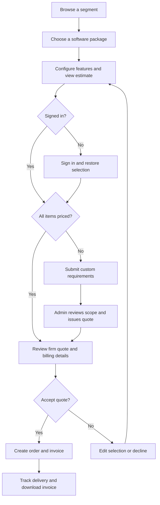
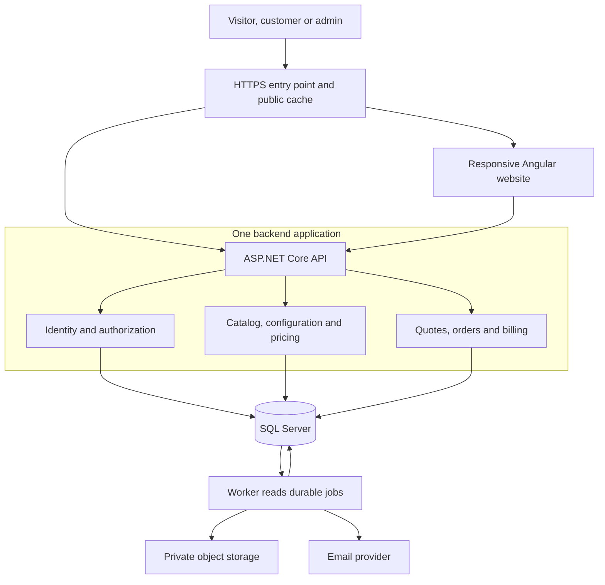
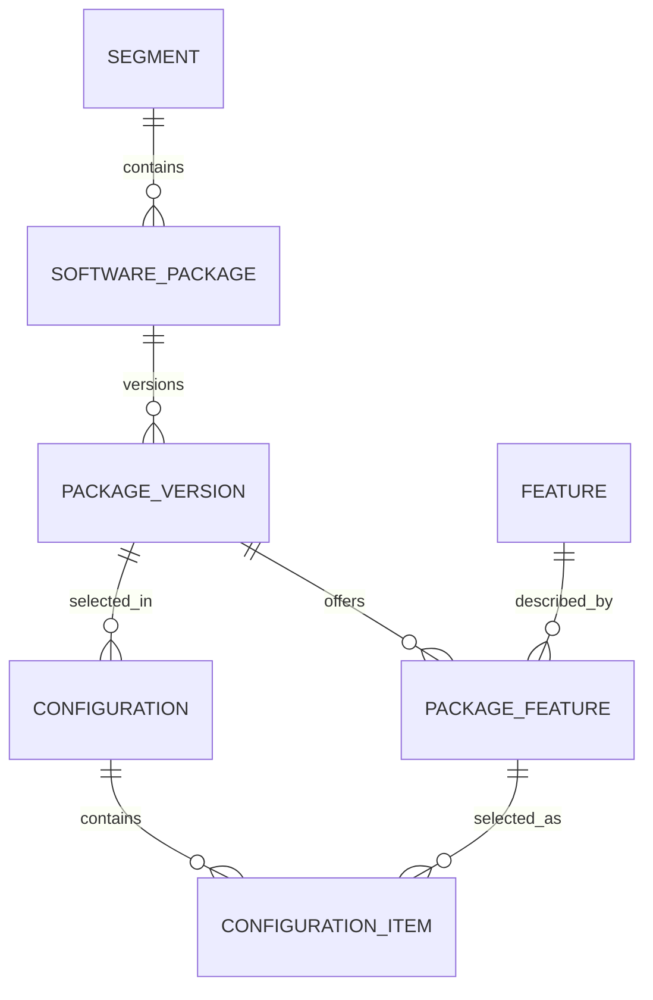
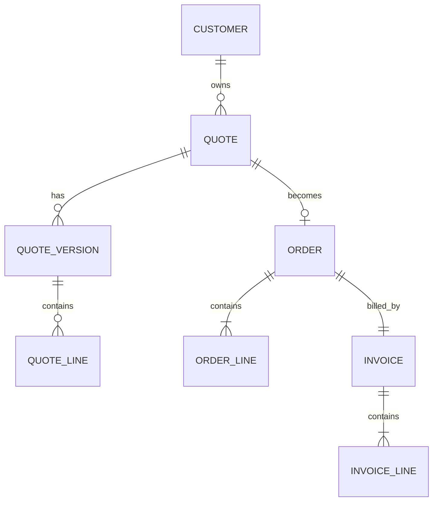
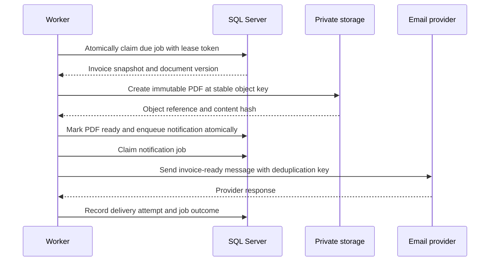
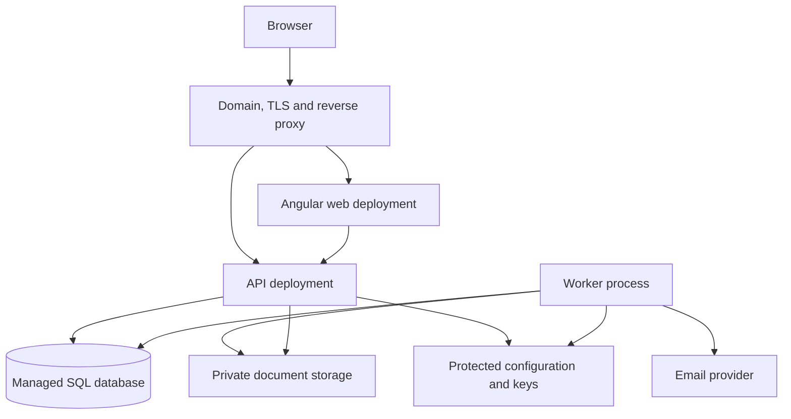

# KnightCore — Detailed High-Level System Design

Version 4 • 27 September 2026 • Angular/.NET MVP implementation and delivery status

KnightCore lets businesses browse ready-developed software, choose additional features, submit custom requirements, place orders, and receive invoices. This specification expands the original design with system boundaries, contracts, data ownership, consistency rules, failure handling, deployment, and growth decisions.

The business rules and service targets below are proposed defaults. Traffic figures are planning examples, not a forecast. This document specifies the target system. An Angular/.NET MVP is now implemented and API-tested; the full target is not yet production-complete or load-tested. See the implementation status below and `Implementation-Status.md` for precise limits.


**Implementation delivery — 27 September 2026.** The source bundle includes Angular customer/admin screens, ASP.NET Core services, EF SQL Server migrations, Docker evaluation setup, automated HTTP smoke tests, and a sample invoice. Authentication, quotes, pricing, order/invoice transactions, concurrent submission protection, custom offers, PDF jobs and ownership checks passed tests using SQLite. Angular and .NET builds passed. SQL Server/Docker, production SMTP/Azure storage, administrator MFA, confirmation resend and a full browser checkout test remain release work. The visual screenshot is a labeled read-only Angular preview, not a deployed .NET website. The target diagrams below remain architectural designs; `diagrams/implemented-runtime.mmd` describes the delivered runtime.

**1. Product boundary and initial decisions.** KnightCore is the seller and operates the storefront. Customers purchase software and customization services. The storefront records what was ordered, what was agreed, what is owed, and delivery progress.

| Decision | Initial design |
| --- | --- |
| Business model | One seller: KnightCore |
| Order unit | One software package and its selected features per order |
| Customer ownership | One signed-in customer owns each configuration, quote, and order |
| Currency | INR initially; retain a currency code on all commercial records |
| Pricing | One-time package fee, priced add-ons, and approved custom work |
| Invoice schedule | One invoice for the accepted one-time order |
| Checkout | Accept a specific quote version; save the order and invoice atomically |
| Payment collection | A later integration; invoicing works independently |
| Product delivery | Admin-managed progress and a final delivery reference |
| Architecture | Modular backend, relational database, durable background jobs |
| Frontend | Angular with TypeScript; one responsive website containing public, customer, and admin routes |
| Device support | Laptop/desktop browsers and Android/iPhone mobile browsers, with layouts that adapt to screen width |

Delivered restaurant, salon, clinic, or property applications have their own runtime and operational data. KnightCore's storefront does not store restaurant transactions, tenant records, or clinical records merely because those software products are sold through it. A catalog feature can map to reusable code in a delivered product; the catalog entry and the running product module remain different concepts.

Recurring billing, installments, customer team accounts, multiple sellers, automatic deployment of sold applications, and online payments are extension points. They are not dependencies of the initial browse–configure–order–invoice flow.

**2. Functional requirements and access.** Browsing, configuration, and estimates work before login. An authenticated customer is required to submit a custom request or place an order. The backend enforces every private operation.

| Capability | Visitor | Customer | Admin |
| --- | --- | --- | --- |
| Browse published segments and packages | Yes | Yes | Yes |
| View included and additional features | Yes | Yes | Yes |
| Configure a package and see an estimate | Yes | Yes | Yes |
| Persist configurations in an account | No | Own records | Support access when authorized |
| Submit new customization requirements | No | Own requests | Review requests |
| Accept a quote and place an order | No | Own quotes | No impersonated customer acceptance |
| Read order progress and invoices | No | Own records | Authorized operational access |
| Publish packages and prices | No | No | Yes |
| Issue custom quotes and update delivery | No | No | Yes |
| Change role assignments or seller settings | No | No | Privileged admin operation |

Additional requirements are selection recovery after login, an itemized price summary, visible quote validity, stable historical scope and prices, protection against duplicate checkout submissions, and private invoice downloads. Admin actions affecting scope, price, status, or billing are audited.

**3. Product catalog and customer experience.** Use Segment → SoftwarePackage → PackageVersion → PackageFeature. The package describes the product; the version freezes the scope and prices offered at a point in time.

| Example segment | Example package | Included capabilities | Optional capabilities |
| --- | --- | --- | --- |
| Restaurants | Restaurant management | Menu, tables, orders, basic billing | Inventory, online ordering, loyalty |
| Salons | Salon management | Appointments, services, customer records | Memberships, commissions, reminders |
| Property owners | Property management | Buildings, units, tenants, rent records | Complaints, collection integrations, reports |
| Clinics | Clinic administration | Appointments, registration, billing | Inventory, reminders, additional workflows |
| Coaching institutes | Institute management | Students, batches, attendance | Online tests, parent access, integrations |
| Manufacturers | Operations management | Products, orders, basic stock | Procurement, production planning, analytics |

These are example catalog entries, not claims that the products already exist. Each package states its supported platform, scope limits, what the customer receives, delivery assumptions, support terms, and base price.

The public configurator displays included features, selectable extras, dependency explanations, and a persistent estimate summary. It marks unpriced requests as “Quote required.” It distinguishes an estimate from the final quote accepted at checkout.

Store only package/version identifiers and selected feature quantities in a guest browser draft. Do not store authentication tokens or billing details there. Collect detailed custom requirements after sign-in. Import the guest selection into an owned Configuration after login and revalidate it against the server. If any selection or price changes, show the difference before asking for acceptance.



**Responsive Angular experience.** Use Angular with TypeScript and responsive CSS/SCSS. Organize the client into public storefront, authentication, configuration/checkout, customer dashboard, and admin feature areas. Use focused components for presentation, injected services for API access, reactive forms for configuration and billing, and lazy loading for customer/admin routes. Keep authoritative pricing and permissions in ASP.NET Core. RxJS can debounce configuration changes and discard superseded estimate requests so an older response cannot replace the current selection's estimate.

Use the same routes, accounts, and backend contracts across screen sizes. Angular route guards guide navigation; the backend authorizes every private operation [7]. Public catalog pages can use Angular server rendering for discoverability, while customer and admin workflows render in the browser [8]. Any server-rendered customer response is private and must never enter a public cache.

| Interface area | Laptop and larger screens | Mobile screens |
| --- | --- | --- |
| Navigation | Full navigation; dashboard sidebar where useful | Compact header and accessible menu drawer |
| Segment/package browsing | Multiple cards per row | One or two readable cards per row, depending on available space |
| Feature configurator | Feature selection beside the itemized price summary | Stacked feature groups and an expandable total summary with a visible checkout action |
| Checkout | Grouped form and adjacent order summary | Single-column form with labeled fields and a review step |
| Orders and invoices | Tables with filters and detailed rows | Summary cards or a focused list; full detail available on opening a record |
| Admin workflows | Workspace with side navigation and tables | Collapsible navigation, focused edit forms, and accessible row actions |

Use CSS Grid/Flexbox and content-driven breakpoints rather than device-name detection. Start with compact layouts below 600 CSS pixels, intermediate layouts from 600 to 1023, and wider layouts at 1024 and above; refine these when real content is implemented. Keep body text at least 16 pixels and aim for 44-by-44 CSS-pixel touch targets. Actions must work without hover. Sticky summaries must not cover fields, errors, the software keyboard, or the final page content.

Acceptance requires the complete browse–configure–login–order–invoice journey on laptop and mobile browsers. Check widths of 320, 390, 768, 1024, 1366, and 1920 CSS pixels, portrait/landscape changes, keyboard navigation, and 200% text enlargement. The page must not develop unintended horizontal scrolling. Contain any genuinely wide tabular content in a labeled region while keeping primary actions and essential values visible. These are implementation requirements, not completed browser tests.

**4. System architecture.** Start with a modular monolith: one ASP.NET Core backend with explicit module interfaces, plus a separate Angular web application. Microsoft describes a single deployment with logical separation as a practical architecture for smaller systems [1]. The choice here follows KnightCore's early operating scale and transactional checkout requirements.



The HTTPS entry point routes page requests to the Angular frontend and /api/* to the backend under the same origin. Angular HttpClient calls the REST API; any public server-rendered routes call the same backend. Configure deep-link handling for client-rendered routes and never route API errors through the frontend page fallback. The browser has no direct database access. The API applies authentication, record ownership, input validation, and business rules before database writes.

PDF generation and email use asynchronous jobs. The worker initially runs as a hosted process within the backend if the hosting environment supports continuous execution. Its jobs remain in SQL Server. It can be separated into an always-running worker deployment without redesigning checkout.

One backend application is not the same as one file or an unstructured codebase. Modules own their business logic; a checkout coordinator composes their operations under one database unit of work. Shared infrastructure contains persistence, logging, clock, email, and file-storage adapters. Controllers remain thin.

**5. Module boundaries and communication.** Logical modules are not separate network services in the first release.

| Module | Owns | Main responsibilities | Communication |
| --- | --- | --- | --- |
| Identity | Users, credentials, roles, billing profiles | Authentication, account recovery, permissions | Middleware and internal interfaces |
| Catalog | Segments, packages, versions, feature offerings | Draft/publish/retire catalog content | Synchronous reads for configuration |
| Configuration | Saved selections and their revision | Validate selected features and quantities | Calls Catalog and Pricing |
| Pricing | Calculation rules and money policy | Produce itemized estimates, resolve dependencies | Pure calculations using versioned inputs |
| Quotes | Requests, quote family, quote versions, terms | Custom review, firm offers, expiry, acceptance | Synchronous checkout validation |
| Orders | Orders, line snapshots, delivery history | Confirm order and manage fulfillment | Synchronous transaction; durable jobs |
| Billing | Seller settings, invoices, numbering | Create invoice records and render documents | Participates in transaction; worker rendering |
| Notifications | Notification jobs and delivery attempts | Order/invoice emails with retries | Asynchronous after committed work |

An API call never invokes another internal module through HTTP. Modules use interfaces and application commands. Database tables can be grouped into logical schemas while sharing one relational transaction. Initially use one infrastructure-managed EF Core unit of work; if separate DbContexts are introduced, they must share the same database connection and transaction for checkout [2].

Catalog publication creates a new package version. Editing a draft is allowed; editing a published version's commercial content is not. Existing quotes and orders retain their original scope and prices.

**6. Pricing and feature rules.** Model a PackageFeature as the offering of a Feature within one PackageVersion. This allows the same capability, such as notifications, to have different limits or prices across packages.

A feature offering contains an identifier, included/optional classification, pricing mode, unit price, allowed quantity range, scope description, dependencies, incompatibilities, and charge interval. Initial pricing modes are Included, Fixed, PerUnit, and RequiresQuote. Only one-time charges are enabled for the first release; recurring charges can be added with an explicit billing schedule later.

The server performs these steps for each estimate:

1. Load the requested published package version.
2. Validate that every selected offering belongs to that version.
3. Validate integer quantities and the meaning of included allowances.
4. Expand dependency requirements and detect incompatible selections.
5. Return missing dependencies for customer approval; do not silently add paid items.
6. Calculate the base fee and selected priced extras.
7. Identify any unpriced custom work.
8. Return the known subtotal, charge breakdown, and whether a firm quote can be produced.

Validate dependency graphs at publication so circular requirements cannot be sold. An included feature contributes no additional price. If the base package includes one branch and an add-on sells additional branches, the add-on quantity means extra branches, not the total branch count.

One-time subtotal = BasePackageAmount + Sum(AddOnUnitPrice × Quantity) + ApprovedCustomAmount.

Invoice total = Sum(BilledLineAmounts) + Sum(ApplicableTaxAmounts).

Use C# decimal arithmetic and SQL decimal(19,2) for INR line amounts and totals; integer quantities in the MVP. Use sufficient decimal precision for tax rates. Round each tax component under a recorded rounding policy, then sum stored rounded amounts. API money values are decimal strings with a currency code, avoiding JavaScript floating-point calculations as the source of truth.

| Illustrative selection | Amount |
| --- | ---: |
| Restaurant base package | ₹20,000 |
| Inventory add-on | ₹5,000 |
| Online ordering add-on | ₹8,000 |
| Known one-time subtotal | ₹33,000 |
| New custom workflow | Quote required until reviewed |

Do not display a final total when a required custom item is unpriced or the applicable tax treatment is unresolved. Show the known subtotal and explain what remains. These example prices are calculation inputs, not recommended selling prices.

A firm quote records the seller/buyer billing snapshots, applicable tax rules and amounts, delivery assumptions, support/license terms, currency, total, and expiry. If relevant billing details change, issue a revised quote. Hosting, maintenance, domain charges, and third-party usage charges must have an explicit inclusion/exclusion statement. Future recurring amounts are shown by period, with only currently billed periods included in the current invoice.

**7. Estimate, quote, and order semantics.** Keep these records distinct.

| Record | Meaning | Can commercial content change? |
| --- | --- | --- |
| Estimate | Current calculation for a selection; no purchase commitment | Yes, whenever inputs change |
| CustomRequest | Requirements that need feasibility/scope review | Clarifications may be added with history |
| QuoteVersion | A specific scope and price offered until expiry | Frozen after offer; revisions create a new version |
| Order | Customer's accepted purchase of one quote version | Accepted commercial scope stays fixed |
| Invoice | Issued billing record for the order | Issued values stay fixed; corrections are explicit |

A Quote is the stable family of revisions. QuoteVersion contains each immutable offered revision. Only the current offered version can be accepted. A quote family can create at most one order, even if different revisions or request keys are submitted concurrently.

For catalog-only purchases, the system creates a firm quote automatically after validating the configuration and billing details. Proposed catalog quote validity is 30 minutes. Admin-issued custom quotes default to seven days, with the actual deadline stored and shown. These durations are adjustable business settings.

A normal catalog price update does not reprice an unexpired firm quote. An expired or explicitly withdrawn offer cannot be accepted. If KnightCore must withdraw an offer, record the reason and request fresh customer acceptance of any replacement.

A configuration edited after quotation does not alter the quote. The customer either accepts the frozen quote or requests a revised one. Copy the custom requirements into the quote's agreed scope; an editable notes field cannot define a finalized sale.

**8. Logical database design.** SQL Server is the source of truth for customer ownership, commercial records, lifecycle transitions, and background work. Store PDFs in object storage and keep references and hashes in SQL.

| Catalog/configuration entity | Key fields and purpose |
| --- | --- |
| Segment | Id, slug, name, description, visibility |
| SoftwarePackage | Id, SegmentId, slug, current published version, status |
| PackageVersion | Id, PackageId, version, base amount, currency, platform, included scope, terms, publication time |
| Feature | Id, code, name, generic description |
| PackageFeature | Id, PackageVersionId, FeatureId, included flag, price mode, unit price, quantity bounds, scope |
| FeatureDependency | Source and required PackageFeature IDs; constrained to the same package version |
| FeatureConflict | Incompatible offering IDs or an exclusive group |
| Configuration | Id, CustomerId, PackageVersionId, revision, state, rowversion |
| ConfigurationItem | ConfigurationId, PackageFeatureId, quantity |

| Commercial entity | Key fields and purpose |
| --- | --- |
| User | Identity framework fields, normalized email, role membership |
| BillingProfile | CustomerId, business/legal name, address, billing identifiers, revision |
| CustomRequest | CustomerId, frozen selection, requirement text, review state, timestamps |
| Quote | Id, CustomerId, ConfigurationId, optional CustomRequestId, current version, state, rowversion |
| QuoteVersion | QuoteId, version, frozen scope, seller/buyer details, terms, totals, expiry, offered timestamp |
| QuoteLine | QuoteVersionId, description, source offering, quantity, unit amount, tax details, line total |
| Order | Id, CustomerId, QuoteId, accepted version, order number, scope snapshot, total, accepted time, delivery state, rowversion |
| OrderLine | OrderId, feature/scope snapshot, quantity, accepted unit amount and totals |
| OrderStatusHistory | OrderId, previous state, next state, actor, time, reason |
| Invoice | Id, OrderId, number/series, issue/due date, billing snapshots, totals, lifecycle, PDF state, object key, hash |
| InvoiceLine | InvoiceId, immutable description, quantity, price, tax components, line total |

| Reliability entity | Key fields and purpose |
| --- | --- |
| IdempotencyRecord | CustomerId, operation, key, normalized request hash, result IDs and response |
| InvoiceNumberSeries | Series ID, next number, configuration; allocated under transaction |
| BackgroundJob | Type, source ID/version, deduplication key, state, available time, lease, attempt count |
| NotificationAttempt | JobId, recipient reference, provider reference, outcome and timestamp |
| AuditLog | Actor, action, entity, selected before/after values, reason, correlation ID, timestamp |

The simplified catalog relationships are:



The commercial relationships are:



The diagrams omit secondary relationships for readability. Orders also reference their customer and exact accepted QuoteVersion. Draft quote versions can exist before line items are complete; offered versions must satisfy the required invariants.

Use foreign keys, nonnegative money checks, positive quantity checks, and the following constraints:

- Unique normalized user email; unique segment slug and package slug.
- Unique (PackageId, version), (PackageVersionId, FeatureId), and (ConfigurationId, PackageFeatureId).
- Unique (QuoteId, version) and UNIQUE(Order.QuoteId).
- UNIQUE(Invoice.OrderId) for the initial one-invoice model.
- Unique (InvoiceSeriesId, sequence number).
- Unique (CustomerId, operation, idempotency key).
- Unique BackgroundJob deduplication key.
- SQL Server rowversion on mutable configurations, quote families, and order progress.

Index public package lookup by segment/status; customer orders by (CustomerId, CreatedAt, Id); quote work by customer/state; admin order queues by state/creation time; jobs by state/available time with an appropriate lease lookup. Paginate lists with stable ordering. Never use sequential invoice or order numbers as authorization.

Commercial snapshots are intentionally duplicated across quote, order, and invoice boundaries. Store queryable amounts in columns; store the detailed agreed scope and tax-rule metadata in versioned snapshots. Archive retired catalog items. Avoid cascading deletes into purchase history.

**9. Checkout transaction and concurrency.** One accepted purchase must produce one durable order and one invoice record. PDF rendering and email occur after this transaction commits.

The checkout input is a quote ID/version, accepted terms version, and Idempotency-Key. The server derives the customer from the authenticated session. It never accepts a client-specified CustomerId or invoice total as authoritative.

```mermaid
sequenceDiagram
    participant C as Customer browser
    participant A as Backend API
    participant D as SQL Server
    participant W as Worker
    C->>A: Place order with quote version and request key
    A->>D: Find completed idempotency result
    alt Matching request already committed
        D-->>A: Original order and invoice IDs
        A-->>C: Original successful result
    else New request
        A->>D: Begin transaction and validate offer
        A->>D: Accept quote and save order plus lines
        A->>D: Allocate invoice number and save invoice
        A->>D: Save PDF job and idempotency result
        A->>D: Commit transaction
        A-->>C: Order confirmed; invoice PDF pending
        W->>D: Claim committed PDF job
    end
```

Inside the short transaction:

1. Verify ownership, current offered quote version, unexpired deadline, and accepted terms.
2. Conditionally transition the quote family from Offered to Accepted using its concurrency token.
3. Insert the order with the exact agreed scope and line amounts.
4. Allocate the invoice number using a locked series row; never use MAX(number) + 1.
5. Insert invoice header and lines copied from the agreed commercial data.
6. Insert the PDF job and the successful idempotency result.
7. Commit all changes together. A failure rolls back the complete unit.

Use the same database transaction across all participating modules. EF Core transaction support provides the required all-or-nothing boundary [2]. Concurrency tokens detect stale writes; uniqueness constraints remain the final protection against duplicate inserts [3]. Transient database retries must rerun the complete unit of work safely, not isolated statements.

Check for a completed idempotency replay before rejecting an expired quote: a previously committed purchase is still valid if the customer retries after its quote expiry. The key is scoped to customer and operation. Identical key plus identical normalized input returns the original response. Identical key plus different input returns a conflict. Concurrent requests for the same key either observe the committed result or receive a retryable in-progress response; they do not create two orders.

If another key submits a quote already converted by the same customer, return its existing order. The permanent unique quote-to-order relationship protects against duplicate conversion after idempotency-record cleanup. Expire ordinary idempotency records after a proposed seven-day recovery window, while retaining the order's unique quote reference.

If admin quote revision and customer acceptance race, only one conditional update to the Quote succeeds. The losing action reloads state. An admin cannot silently supersede an already accepted quote.

**10. Invoice generation and durable jobs.** The BackgroundJob table serves as the initial transactional outbox: intent to generate the invoice is saved in the same transaction as the order. Microsoft documents this pattern for reliably coupling business changes and deferred work [4]. A separate message broker is not needed for this first implementation.



Job delivery is at least once. Handlers must therefore tolerate repeated execution. Claim a due job atomically and record a bounded lease and claim token. Renew the lease for long work; a worker with an expired claim cannot finalize another worker's job. Make external calls outside the SQL transaction.

Use a stable object key such as invoices/{invoiceId}/{documentVersion}.pdf with conditional creation. After an upload followed by a database failure, the retry checks the same object and hash and completes the database update. Preserve the first committed PDF rather than overwriting it during retry. Store template version and snapshot data to support controlled regeneration.

Marking the PDF ready, completing its generation job, and enqueuing the notification are one transaction. Otherwise a crash could leave a ready invoice without a notification job.

Use bounded exponential backoff with jitter for transient errors. After a configured attempt limit, move the job to FailedNeedsAttention and alert admin. Fixing the cause requeues the same work identity. Do not issue a new invoice to recover a failed PDF job.

Email providers may not support reliable deduplication. If they do, use the stable notification key. If the provider accepted a send but its response was lost, a repeated email remains possible unless provider reconciliation or idempotency resolves it. Record this uncertainty; order and invoice uniqueness do not depend on email delivery.

The PDF includes seller and buyer details, number, dates, scope summary, line quantities and amounts, applicable tax breakdown, currency, total, payment terms, and order reference. Invoice issuance and PDF readiness are different states. A payment receipt or balance history can be added when payment tracking is enabled.

Invoice corrections preserve the original issued record and use an audited void/correction or adjustment workflow under the configured billing rules. Cancellation of delivery does not silently delete the invoice. Tax rates, billing identifiers, and document timing are configurable business inputs; this specification does not choose a legal tax treatment.

**11. State machines and change control.** Store independent states instead of encoding every combination into one large order status.

| Record | Normal path | Other controlled transitions |
| --- | --- | --- |
| CustomRequest | Submitted → Reviewing → Quoted | NeedsInformation, Declined, Closed |
| Quote family | Draft → Offered → Accepted | Expired, Declined, Withdrawn; offering a revision changes current version |
| Quote version | Draft → Offered | Superseded when a new version is offered; commercial contents remain preserved |
| Order fulfillment | Confirmed → InProgress → ReadyForReview → Delivered → Completed | OnHold, Cancelled, or return to InProgress after review |
| Invoice lifecycle | Issued | Explicit void/correction handling where applicable |
| Invoice PDF | Pending → Ready | RetryScheduled, FailedNeedsAttention |
| Background job | Pending → Processing → Succeeded | RetryScheduled, FailedNeedsAttention |
| Payment, when added | Unpaid → PartiallyPaid → Paid | Separate reversal/refund events |

Every state transition checks the current state, actor permission, and concurrency token. Keep actor/time/reason history for order and commercial changes. A new request after order confirmation is a change request with separately agreed scope and price; it does not mutate accepted line items. The MVP can record that request for manual handling, with a later order or approved amendment before extra work is billed.

Delivery references can identify a deployment, repository handoff, or approved download. They contain no plaintext production passwords. Access remains scoped to the order owner. Customer review and completion are explicit actions with recorded timestamps.

**12. API contract.** Version the API under /api/v1. Request examples use illustrative identifiers, not a required ID encoding. List endpoints are paginated; money is represented as decimal strings and dates as UTC ISO timestamps.

| Method and route after /api/v1 | Access | Purpose |
| --- | --- | --- |
| GET /segments | Public | Published top-level segments |
| GET /segments/{slug}/packages | Public | Packages within a segment |
| GET /packages/{id} | Public | Current package, features, limits, pricing version |
| POST /estimates | Public, rate-limited | Recalculate selected feature estimate |
| POST /auth/register, /auth/login | Public with appropriate protections | Establish customer identity |
| POST /auth/logout | Authenticated | End session |
| GET /auth/session | Authenticated | Current identity and permitted capabilities |
| GET /auth/csrf | Browser session | Obtain antiforgery token |
| POST /configurations | Customer | Import or save selections |
| PATCH /configurations/{id} | Owner, If-Match | Update an owned draft |
| PUT /billing-profile | Customer, version checked | Save billing details |
| POST /quotes | Customer | Generate a firm catalog quote |
| GET /quotes/{id} | Owner | Read offered scope and version |
| POST /custom-requests | Customer | Submit frozen selection and new requirements |
| POST /orders | Customer, idempotent | Accept quote version and create purchase |
| GET /orders, /orders/{id} | Customer ownership enforced | Purchase list and detail |
| GET /invoices/{id} | Owner | Invoice metadata and PDF readiness |
| POST /invoices/{id}/download | Owner | Return a short-lived authorized download URL |
| POST /admin/package-versions | Admin | Create catalog draft |
| POST /admin/package-versions/{id}/publish | Admin, version checked | Validate and publish immutable offering |
| GET /admin/custom-requests | Admin | Review queue |
| POST /admin/custom-requests/{id}/quotes | Admin | Create custom quote draft |
| POST /admin/quotes/{id}/offer | Admin, version checked | Offer new quote version |
| PATCH /admin/orders/{id}/status | Admin, If-Match | Controlled fulfillment transition |
| POST /admin/jobs/{id}/retry | Admin | Retry failed background work |

The API additionally supplies owner-scoped configuration/custom-request reads and the customer's review/acceptance actions needed by the dashboard. Do not expose generic database CRUD endpoints.

An estimate request supplies selection identifiers, not prices:

```json
{
  "packageVersionId": "restaurant-v3",
  "items": [
    { "packageFeatureId": "inventory-v3", "quantity": 1 },
    { "packageFeatureId": "online-ordering-v3", "quantity": 1 }
  ]
}
```

A corresponding estimate response can be:

```json
{
  "currency": "INR",
  "knownSubtotal": "33000.00",
  "taxStatus": "RequiresBillingDetails",
  "finalTotal": null,
  "requiresCustomQuote": false,
  "packageVersionId": "restaurant-v3"
}
```

After the customer reviews a firm quote, POST /orders supplies Idempotency-Key in a header and this body:

```json
{
  "quoteId": "quote-123",
  "quoteVersion": 2,
  "acceptedTermsVersion": "terms-2026-09"
}
```

The successful response is 201 Created with orderId, invoiceId, orderStatus = Confirmed, invoicePdfStatus = Pending, and resource URLs. Store the replayable result in the transaction. The customer dashboard refreshes invoice readiness; it need not hold the checkout request open until the PDF is rendered.

Use structured errors containing code, user-facing message, correlationId, and field errors when relevant:

| Situation | Response |
| --- | --- |
| Login required or expired session | 401 |
| Known authenticated actor lacks an admin permission | 403 |
| Missing or another customer's private record | 404 |
| Stale If-Match concurrency token | 412 |
| Expired/superseded quote, conflicting idempotency input | 409 with a specific error code |
| Invalid quantities or missing feature dependencies | 422 with actionable field details |
| Rate limit reached | 429 with Retry-After |
| Database unavailable before commit | 503; retry using the same request key |

Neither a client timeout nor a generic error proves that a transaction failed. The client retries with the original key and can recover the existing order.

**13. Security and customer isolation.** Use ASP.NET Core Identity with secure, HttpOnly, host-only session cookies for the website. The backend owns login and permission decisions. Angular uses the session response for navigation and route guards; private API authorization remains on the server [7]. Configure the Angular antiforgery request header and the ASP.NET Core validator to use the same token contract. The authentication cookie remains HttpOnly.

Apply antiforgery validation to state-changing browser requests, including session operations. A same-origin deployment simplifies browser integration, but does not remove the need for CSRF protection [5]. Use HTTPS, appropriate SameSite settings, an explicit origin policy, and a validated local return URL after login.

Require confirmed email for order submission, with a recovery/resend flow. Apply login throttling and administrator MFA. Use framework password hashing and short-lived recovery tokens. Invalidate sessions when credentials or privileged access change.

The API derives CustomerId from the session and filters private queries accordingly. Download authorization occurs before generating a short-lived file URL. Opaque IDs reduce casual enumeration, but never replace ownership checks. Public caches cannot contain customer, admin, quote, or invoice responses.

Persist and protect the ASP.NET Core Data Protection key ring across restarts. API replicas share the correct application identity and key store so scaling does not invalidate authentication unexpectedly [6]. Restrict access to the keys and do not place them in an ephemeral container filesystem.

Keep secrets outside source code; give API and worker identities only the database/storage/provider permissions they need. Restrict database connectivity to application infrastructure. Escape catalog/custom text in HTML and PDFs. PDF rendering uses controlled templates and local assets, with arbitrary external fetches disabled to prevent server-side request abuse.

Log operational identifiers and outcomes while excluding passwords, session cookies, reset tokens, billing addresses, and full custom requirement text. Audit admin commercial changes with a stated reason and controlled access.

**14. Nonfunctional targets and capacity assumptions.** These are proposed starting targets for validation, not measured guarantees.

| Area | Initial target or requirement |
| --- | --- |
| Availability | 99.5% monthly for core public browsing and purchase operations; revise with hosting and budget |
| Read latency | p95 public catalog API processing below 300 ms under the agreed test load |
| Estimate latency | p95 below 500 ms; frontend debounce around 250 ms |
| Checkout latency | p95 transaction/API response below 1 second, excluding user and network time |
| Invoice readiness | 95% of PDFs ready within 30 seconds under normal conditions |
| Correctness | No duplicate order per quote; invoice totals match the accepted commercial snapshot |
| Recovery | Proposed RPO ≤ 15 minutes and RTO ≤ 4 hours, subject to configured backup/PITR and restore exercises |
| Accessibility | Keyboard-operable forms, readable summaries, labeled errors, touch controls, and responsive laptop/mobile layouts verified across the specified widths |
| Maintainability | Module ownership, versioned contracts, repeatable migrations, minimal operating components |

RPO is the maximum target data-loss window after a disaster; RTO is the target time to restore service. Database failover and backup restoration are different mechanisms. A backup alone does not meet a recovery target.

An illustrative growth scenario helps size tests:

| Assumption | Calculation |
| --- | --- |
| 10,000 visitors/day, 15 dynamic API calls each | 150,000 requests/day |
| Average request rate | 150,000 / 86,400 ≈ 1.74 requests/second |
| Illustrative 20× burst factor | Approximately 35 requests/second |
| 100 confirmed orders/day | 36,500 orders/year |
| 250 KB per invoice PDF | Approximately 9.1 GB/year, before versions/backups |
| 25 KB of core commercial data per order | Approximately 0.91 GB/year, excluding indexes, logs, drafts, and audit history |

These inputs are not a conversion-rate claim. Public assets and CDN hits are separate from the dynamic request calculation. Drafts, quote revisions, and monitoring retention may exceed the core order data. Validate a proposed 50 requests/second mixed workload and concurrent checkout races; choose runtime capacity from the result rather than assuming a particular server size.

**15. Caching, consistency, and scaling.** Public reads can tolerate bounded staleness; accepted commercial records require transactional consistency.

| Data | Strategy | Correctness boundary |
| --- | --- | --- |
| Images, fonts, static assets | CDN with versioned filenames | No private content |
| Segment/package listing | Short public cache, initially up to 60 seconds; invalidate on publication | Checkout uses authoritative state |
| Immutable package version | Version-keyed cache with bounded retention | Prices remain tied to that version |
| Guest draft | Browser selection IDs and quantities only | Revalidated after login |
| Estimate response | Normally no shared cache; calculate from validated inputs | Not a firm commercial promise |
| Quote and checkout | Read authoritative primary database | No stale replica for acceptance |
| Customer/admin pages | Private/no-store where sensitive | Never served from public cache |
| Invoice PDF | Private immutable object | Authorized short-lived access |

Debounce estimate requests and bound selection size to avoid unnecessary load. If an optional catalog cache fails, fall back to the database with bounded request concurrency. A cached public page may remain available during an outage, but checkout must not claim success without a durable commit.

Scale using observed pressure:

1. Optimize slow queries and indexes when database time dominates latency.
2. Add stateless API replicas when CPU or request queues exceed the tested operating range; share authentication keys and persistent state.
3. Separate PDF workers when render work affects API latency. Bound their concurrency to protect the database and memory.
4. Add a shared catalog cache only if repeated reads materially load SQL.
5. Consider read replicas for reporting once the primary is constrained; keep checkout and immediate purchase reads on the primary.
6. Extract a module into a service only when independent scale, releases, ownership, or isolation justify it.

PDF/notification work is an early candidate for separate deployment because it already uses durable jobs. Separating Orders and Billing is more consequential: their shared transaction would need a distributed workflow, reconciliation, and explicit failure semantics.

**16. Deployment and operations.** Use separate development, staging, and production environments. The initial production topology is one web deployment, one API deployment, one managed SQL database, private object storage, and transactional email. The API may host the worker initially; an independent worker is the next operating step.



The Angular deployment serves browser assets and any configured public server-rendered routes; the latter require a supported server runtime. Customer/admin routes use browser rendering and call the same-origin API. The API-to-storage path issues authorized downloads or streams files. Its identity need not have the same permissions as the PDF worker. Production deployments must keep the worker alive or use a managed background execution mechanism; a process that sleeps indefinitely cannot meet invoice readiness targets.

A CI/CD pipeline builds the frontend and backend, validates the critical flows, runs reviewed migrations, deploys to staging, and performs a smoke checkout before promoting the same build. Apply migrations through one controlled job. Do not let every application replica race to migrate the database.

Prefer additive database changes and compatible rollout steps. A binary rollback is safe only while the schema and stored job payloads remain compatible. Jobs and document templates carry schema/version information so a deployment does not make pending work unreadable.

Use health checks that distinguish process liveness from readiness. The API needs working database access for checkout; an email outage should degrade notifications without making browsing or order confirmation unavailable.

A single application instance is an availability risk. If the agreed availability requires uninterrupted deployments or instance-failure tolerance, use multiple replicas behind the entry point and appropriate managed database redundancy. Hosting redundancy and regional disaster recovery are separate decisions.

**17. Failure handling and observability.** Design visible recovery paths around the actual purchase flow.

| Failure | Required behavior |
| --- | --- |
| Login after anonymous configuration | Restore selection, validate, then resume checkout |
| Price changed before firm quote | Show revised amount before acceptance |
| Firm quote expired | Generate/obtain a new offer; do not silently extend or reprice |
| Quote superseded during checkout | Reject stale version or return already accepted order |
| Customer double-click or network retry | Return the same committed order |
| API crashes before transaction commit | No partial order/invoice/job survives |
| API response lost after commit | Same request key recovers original order |
| PDF renderer fails | Order remains confirmed; PDF status and retry are visible |
| Worker crashes after upload | Reconcile stable object key and finalize the same invoice |
| Email provider unavailable | Retry notification; invoice stays downloadable |
| Private storage unavailable | Preserve invoice record and queue work; show temporary unavailability |
| Database unavailable | Fail checkout safely; do not accept an in-memory order |
| Catalog cache stale | Revalidate before firm quote/acceptance |
| Admin changes an order from a stale screen | Reject conflicting update and refresh |

Trace the browser request through quote acceptance, transaction, job, PDF, and notification with a correlation ID and record IDs. Keep application logs, business audit history, and metrics separate in purpose and access.

Monitor API p95/p99 latency, error rates, database transaction failures, quote acceptance conflicts, idempotency replay counts, oldest pending job age, failed job count, PDF generation latency, email outcomes, and unauthorized access attempts. Alert on sustained checkout errors, stalled invoice work, and failed backup/restore checks. Set alert thresholds from the agreed service targets and observed normal traffic.

Recovery requires encrypted database backups/PITR, retention for original PDFs, protected key backup, and a repeatable restore runbook. Practice restoring into an isolated environment. Before resuming invoice issuance after a data-loss restore, reconcile the recovered orders, stored PDFs, and invoice number high-water marks so already-issued numbers cannot be reused.

Keep operational logs for a defined period and purchase records under an explicit business retention policy. Do not infer a statutory retention period from the architecture.

**18. Delivery milestones and acceptance evidence.** Build in slices that exercise complete user outcomes.

| Milestone | Scope | Evidence required before moving on |
| --- | --- | --- |
| Catalog | Admin drafts/publishing; public segments and package pages | New segment/package appears without code changes; retired version remains historical |
| Configurator | Included/additional features; dependencies; price summary | Server rejects tampered prices/quantities and explains missing dependencies |
| Identity | Registration/login, roles, guest selection restore | Customer returns to the same valid selection; private data stays isolated |
| Quotation | Catalog quotes, custom review, immutable revisions | Unpriced work cannot reach checkout; stale/expired offers cannot be accepted |
| Orders and billing | Atomic purchase, numbering, snapshots, idempotency | Concurrent submissions create one order and one invoice |
| Documents and delivery | PDF worker, notifications, order progress | Restart/retry recovers work without changing invoice identity |
| Production readiness | Deployment, observability, recovery, responsive browser verification | Restore exercise and complete customer/admin flows succeed on laptop and mobile layouts in staging |

High-value verification scenarios include two simultaneous acceptances of one quote; the same key with a different body; catalog price changes before and after quotation; billing changes requiring re-quotation; dependency cycles; customer A attempting customer B's download; a crash after commit; a worker crash after upload; and an invoice still matching its accepted quote after later catalog edits.

No fixed delivery duration is asserted because development capacity, product inventory, and deployment constraints have not yet been measured.

**19. Decisions to configure before launch.** These settings can be filled in without changing the core architecture.

| Setting | Proposed default or needed value |
| --- | --- |
| Initial segments/products | Publish only software KnightCore can actually deliver |
| Included scope and add-on prices | Define per published package version |
| License/source-code handover and support | State explicitly in versioned offer terms |
| Timeline and customization review | Catalog baseline; custom timeline set during review |
| Quote validity | 30 minutes for catalog; seven days for custom, configurable |
| Invoice numbering and seller details | Configure business series and billing profile |
| Tax calculation/document policy | Supply applicable business rules; no hardcoded assumed rate |
| Payment terms | Show due date and accepted payment method; gateway integration later |
| Recovery/service targets | Validate the proposed targets against selected hosting and tests |
| Hosting/provider budget | Select after measuring the representative workload |

**20. Primary technical references.** Architecture and business decisions in this specification are recommendations for KnightCore. The documents below support the technical mechanisms; they do not prescribe KnightCore's prices, targets, or workflows.

1. [Microsoft: Common web application architectures](https://learn.microsoft.com/en-us/dotnet/architecture/modern-web-apps-azure/common-web-application-architectures) — modular organization within one deployment.
2. [Microsoft: EF Core transactions](https://learn.microsoft.com/en-us/ef/core/saving/transactions) — atomic writes and shared transactions.
3. [Microsoft: Handling concurrency conflicts](https://learn.microsoft.com/en-us/ef/core/saving/concurrency) — concurrency tokens and SQL Server rowversion.
4. [Microsoft: Transactional outbox pattern](https://learn.microsoft.com/en-us/azure/architecture/databases/guide/transactional-out-box-cosmos) — durable business changes and deferred work; includes relational database guidance.
5. [Microsoft: ASP.NET Core antiforgery](https://learn.microsoft.com/en-us/aspnet/core/security/anti-request-forgery) — protection for browser requests authenticated with cookies.
6. [Microsoft: Configure Data Protection](https://learn.microsoft.com/en-us/aspnet/core/security/data-protection/configuration/overview) — persistent protected keys and configuration across application instances.
7. [Angular: Route guards](https://angular.dev/guide/routing/route-guards) — navigation controls with server-side authorization retained.
8. [Angular: Server-side and hybrid rendering](https://angular.dev/guide/ssr) — route-specific rendering for public content and interactive application areas.
